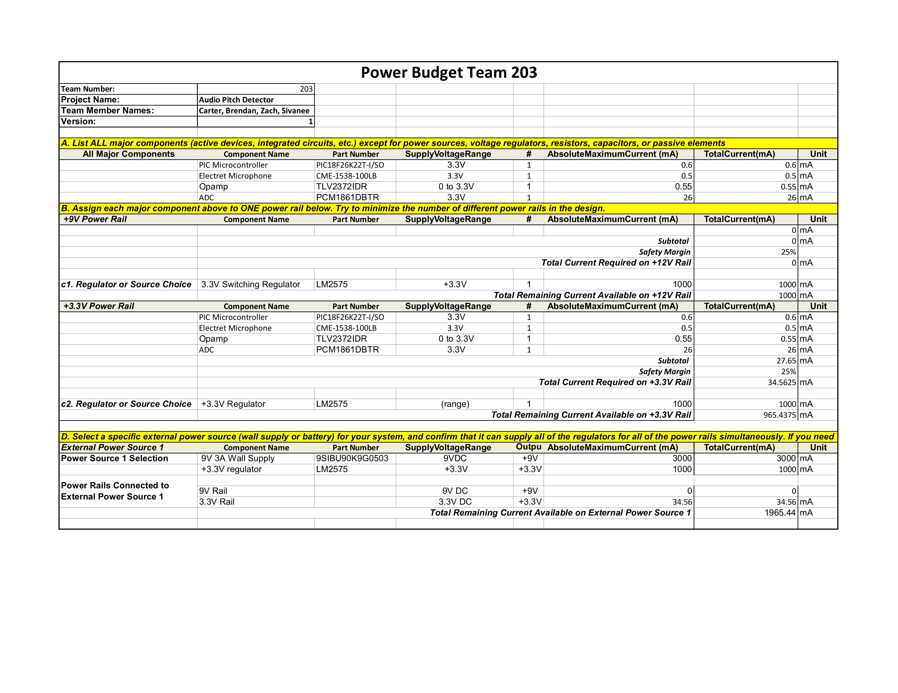

## Image 1: Carter ONeill's Schematic for Team 203

My schematic satisfies the needs of the k-12 children expected to use this equipment by providing them a means of interacting with our model vocally. The inclusion of a simple low fidelity microphone allows for raw self expression. Requirements for our group project are to include one sensor subsystem which communicates to my micro-controller via I2C, and with the inclusion of the ADC I take the input signal from the amp and output to my micro-controller with I2C as intended.

## PDF Link

[Open PDF](./EGR314_CarterONeill_Schematic1.pdf)

## Zip File  

[Download ZIP](./EGR314_CARTERONEILL00.zip)

## Power Budget

## Zip File for Power Budget  

[Download ZIP](./Power_Budget_Carter.zip)

The power budget highlights how efficient my system is, and demonstrates the need for a switching regulator. Running a linear regulator with this setup would generate a lot of heat. The components I am using will likely be lower energy than calculated here, in the tens of milliamps, due to the majority of accessories being excluded from use.

## Version 2.0

If I had the chance to rework my project to make a second version of my schematic, I feel it would be paramount to add as many through hole debugging jumpers as possible. I had great difficulty debugging my ESP-32 due to many of the pins either being assigned to GND with no jumper or pins being mapped wrong. I was satisfied with the amount of debugging LED's I used, but due to my inability to even get my ESP programmed they were not used. I had accidentally set the wrong USB data pins on my PCB, and the lack of spare jumper points made the re-routing of the signal perilously difficult. Furthermore, my board was populated with sections for 0 ohm resistors, which ended up being a painful and less than useful compromise compared to jumpers. I would also add more GPIO pins in the future, since the ESP GPIO pins are readily configurable, if they aren't being left open for programming it is essentially a waste.

My second greatest hurdle was the issues with the voltage regulator. Even after ordering a better inductor, and double checking the capacitors, the regulator did not output stable voltage. I was able to test the rest of my components with steady DC output from a bench supply to compensate. Oscilloscope testing did show the capacitors behaving as expected, but I believe the inductor was ultimately unequipped for the regulation.

Starting the testing process earlier, and overcoming these issues earlier would have allowed me to thrive later in the course.
