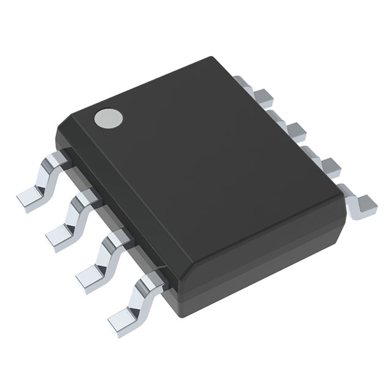
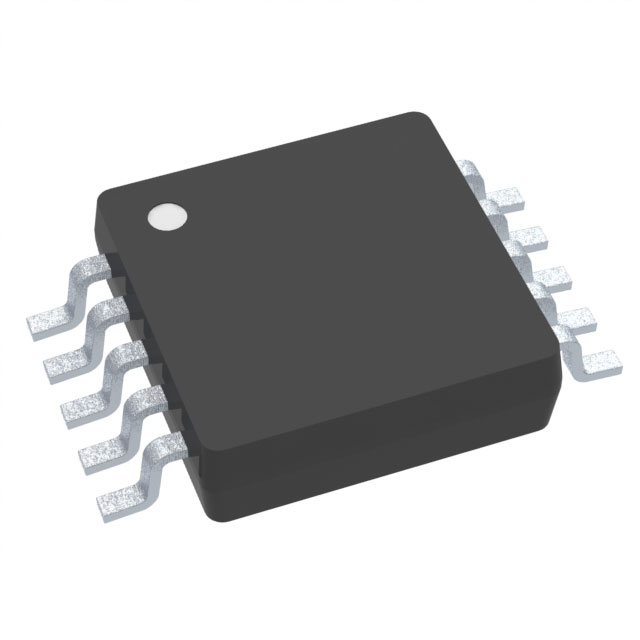

## Table 1: Component Selection

### Power Supply

| Solution  | Pros  | Cons  |
|-----------|-------|-------|
|    **Option 1:** TPS7A4700RGWT Surface mount linear voltage regulator   **$5.86/each**   [Link to product](https://www.digikey.com/en/products/detail/texas-instruments/TPS7A4700RGWT/3516850) | * Smaller footprint  | * Price |
|    **Option 2:** LM2675MX 3.3v 1A surface mount switching regulator   **$4.36/each**   [Link to product](https://www.digikey.com/en/products/detail/texas-instruments/LM2675MX-3-3-NOPB/366907) | * Surface mount variation of the one we are familiar with from class | * Bigger Footprint |

### **Choice:** Option 2: LM2675MX 3.3v 1A surface mount switching regulator

**Rationale:** While the SOIC footprint takes up more space, ultimately it will be easier to solder to my PCB. The price is less expensive than the alternative, and it has less wasted pins. Less pins are better to work with because they reduce the chance for manufacturing errors from bridged solder. Design is also simpler.

### Signal Input

| Solution  | Pros  | Cons  |
|-----------|-------|-------|
|    **Option 1:** SPU0410HR5H-QB Surface-mount MEMS Microphone   **$0.66/each**   [Link to product](https://www.digikey.com/en/products/detail/knowles/SPU0410LR5H-QB/2420974) | * Small footprint   * Low power consumption | * Limited frequency response   * Slightly lower sensitivity |
|    **Option 2:** CME-1538-100LB Electret Condenser Microphone   **$3.53/each**   [Link to product](https://www.digikey.com/en/products/detail/same-sky-formerly-cui-devices/CME-1538-100LB/2364631) | * Superior frequency response   * Higher sensitivity   * Well-matched impedance for project | * Requires external biasing circuit   * Slightly larger footprint |

### **Choice:** Option 2: CME-1538-100LB Electret Condenser Microphone

**Rationale:** The slightly larger size is worth the improved sensitivity and frequency response. While the MEMS option is more compact, its limited range could impact signal quality, making the condenser microphone the better choice for this project.

---

### Amplification

| Solution  | Pros  | Cons  |
|-----------|-------|-------|
|    **Option 1:** LM358DR General-Purpose Dual Op-Amp   **$0.18/each**   [Link to product](https://www.digikey.com/en/products/detail/texas-instruments/LM358DR/276658) | * Inexpensive   * Readily available   * Simple to implement | * Limited bandwidth   * Higher noise levels   * Input voltage range constraints |
|    **Option 2:** TLV2372IDR Rail-to-Rail Dual Op-Amp   **$1.48/each**   [Link to product](https://www.digikey.com/en/products/detail/texas-instruments/TLV2372IDR/381216) | * Rail-to-rail input and output   * Low noise performance   * Optimized for precision applications | * Slightly higher cost   * Requires careful PCB layout for optimal performance |

### **Choice:** Option 2: TLV2372IDR Rail-to-Rail Dual Op-Amp

**Rationale:** Despite the higher cost, the TLV2372IDR offers better precision and lower noise, which is essential for clean signal amplification. The LM358DR is cheaper but introduces unnecessary noise and has a limited input range, making it less ideal.

---

### ADC (Analog-to-Digital Converter)

| Solution  | Pros  | Cons  |
|-----------|-------|-------|
|    **Option 1:** ADS1115IDGSR 16-Bit ADC with I²C Interface   **$4.39/each**   [Link to product](https://www.digikey.com/en/products/detail/texas-instruments/ADS1115IDGSR/2231567) | * Cheaper alternative   * Integrated PGA   * Simple I²C interface | * Lower resolution (16-bit vs. 24-bit)   * Higher noise floor   * Slower sampling rate |
|    **Option 2:** PCM1861DBTR 24-Bit Stereo ADC   **$4.42/each**   [Link to product](https://www.digikey.com/en/products/detail/texas-instruments/PCM1861DBTR/4809044) | * High-resolution 24-bit conversion   * Integrated PGA for flexibility   * Low noise and distortion | * Slightly higher price   * Requires I²S communication setup |

### **Choice:** Option 2: PCM1861DBTR 24-Bit Stereo ADC

**Rationale:** The higher resolution and lower noise make this ADC the superior choice. While the ADS1115IDGSR is cheaper and easier to implement, its lower resolution and noise performance could degrade signal accuracy, making it unsuitable for this project.

---

### Table 2: Microcontroller Selection 
### PIC18F47Q10
| PIC18F47Q10 Info                                      | Answer                                                                                                                                                                                                                 | Help                                                                                                                                                                                                                   |
|-----------------------------------------------|------------------------------------------------------------------------------------------------------------------------------------------------------------------------------------------------------------------------|------------------------------------------------------------------------------------------------------------------------------------------------------------------------------------------------------------------------|
| Model                                         | PIC18F47Q10                                                                                                                                                                                                            |                                                                                                                                                                                                                        |
| Product Page URL                              | [Product](https://www.microchip.com/en-us/product/pic18f47q10)                                                                                                                                                         |                                                                                                                                                                                                                        |
| Datasheet URL(s)                              | [Datasheet](https://ww1.microchip.com/downloads/aemDocuments/documents/MCU08/ProductDocuments/DataSheets/PIC18F27-47Q10-Micorcontroller-Data-Sheet-DS40002043.pdf)                                                    |                                                                                                                                                                                                                        |
| Application Notes URL(s)                      | [Application Notes](https://www.microchip.com/en-us/application-notes/tb3261)                                                                                                                                          |                                                                                                                                                                                                                        |
| Vendor link                                   | [Digikey](https://www.digikey.com/en/products/detail/microchip-technology/PIC18F47Q10-I-P/10187785) | Digikey, Jameco, etc. Do not paste links directly into the table. Use a [link](#)                                                                                               |
| Code Examples                                 | [GitHub Repository](https://github.com/microchip-pic-avr-examples/pic18f47q10-cnano-eusart-hello-world-fs)                                                                                                             | URL(s) for libraries on GitHub or other sites related to the microcontroller and your planned peripherals                                                                       |
| External Resources URL(s)                     | [YouTube Tutorial](https://www.youtube.com/watch?v=PTxtKFsntQ4)                                                                                                                                                        | Search on Google and YouTube for other resources for each specific microcontroller.                                                                                             |
| Unit cost                                     | Approximately $2.52                                                                                                                                                                                                   | Find in the Microchip online store, or Digikey                                                                                                                                                                         |
| Absolute Maximum Current for entire IC        | 80 mA                                                                                                                                                                                                                 | Find in the microcontroller datasheet                                                                                                                                                                                  |
| Supply Voltage Range                          | Min: 1.8V / Max: 5.5V                                                                                                                                                                                                 | Min / Nominal / Max / Absolute Max, as found in datasheet                                                                                                                       |
| Maximum GPIO current (per pin)                | 25 mA                                                                                                                                                                                                                 | As found in datasheet                                                                                                                                                                                                  |
| Supports External Interrupts?                 | Yes                                                                                                                                                                                                                   | As found in datasheet                                                                                                                                                                                                  |
| Required Programming Hardware, Cost, URL      | [PICkit 5 In-Circuit Debugger](https://www.microchip.com/en-us/development-tool/pg164150), approximately $94.99                                                                                                      | Found on the microcontroller's product page                                                                                                                                                                            |
| Works with MPLabX?                            | Yes                                                                                                                                                                                                                   | Required. See [Microchip Development Tools](https://www.microchip.com/development-tools)                                                                                         |
| Works with Microchip Code Configurator?       | Yes                                                                                                                                                                                                                   | Can be validated in MPLabX. Screenshot required.                                                                                                                                |

| Module | # Available | Needed | Associated Pins (or * for any) |
| ---------- | ----------- | ------ | ------------------------------ |
| GPIO       | 35          | 8      | Ports A, B, C, D               |
| ADC        | N/A         | 0      | not needed                     |
| UART       | 1           | 1      | RC6, RC7                       |
| SPI        | 1           | 1      | MSSP Module                    |
| I2C        | 1           | 1      | I2C1                           |
| PWM        | N/A         | 0      | not needed                     |
| ICSP       | 1           | 1      | RB7,RB6                        |
| ...        | ...         | ...    | ...                            |

### PIC18F25K50
| ESP Info                                      | Answer                                                                                                                                                                                                                 | Help                                                                                                                                                                                                                   |
|-----------------------------------------------|------------------------------------------------------------------------------------------------------------------------------------------------------------------------------------------------------------------------|------------------------------------------------------------------------------------------------------------------------------------------------------------------------------------------------------------------------|
| Model                                         | PIC18F25K50                                                                                                                                                                                                          |                                                                                                                                                                                                                        |
| Product Page URL                              | [Product](https://www.microchip.com/en-us/product/pic18f25k50)                                                                                                                                                        |                                                                                                                                                                                                                        |
| Datasheet URL(s)                              | [Datasheet](https://ww1.microchip.com/downloads/en/DeviceDoc/41431D.pdf)                                                                                                      |                                                                                                                                                                                                                        |
| Application Notes URL(s)                      | [Application Notes](https://www.microchip.com/en-us/application-notes)                                                                                                                                                |                                                                                                                                                                                                                        |
| Vendor link                                   | [Digikey](https://www.digikey.com/en/products/detail/microchip-technology/PIC18F25K50-I-SO/3671501)                                                                                                                                                                                         | Digikey, Jameco, etc. Do not paste links directly into the table. Use a [link](#).                                                                                                |
| Code Examples                                 | [Microchip Code Examples](https://github.com/microchip-pic-avr-examples)                                                                                                      | URL(s) for libraries on GitHub or other sites related to the microcontroller and your planned peripherals.                                                                       |
| External Resources URL(s)                     | [YouTube Tutorial](https://www.youtube.com/watch?v=yHVhM-pLRXk)                                                                                                               | Search on Google and YouTube for other resources for each specific microcontroller.                                                                                             |
| Unit cost                                     | Approximately $3.80                                                                                                                                                           | Find in the Microchip online store, or Digikey.                                                                                                                                                                         |
| Absolute Maximum Current for entire IC        | 250 mA                                                                                                                                                                        | Find in the microcontroller datasheet.                                                                                                                                                                                  |
| Supply Voltage Range                          | Min: 1.8V / Max: 3.6V                                                                                                                                                         | Min / Nominal / Max / Absolute Max, as found in datasheet.                                                                                                                       |
| Maximum GPIO current (per pin)                | 25 mA                                                                                                                                                                         | As found in datasheet.                                                                                                                                                                                                  |
| Supports External Interrupts?                 | Yes                                                                                                                                                                           | As found in datasheet.                                                                                                                                                                                                  |
| Required Programming Hardware, Cost, URL      | [PICkit 5 In-Circuit Debugger](https://www.microchip.com/en-us/development-tool/pg164150), approximately $94.99                                                                                                                        | Found on the microcontroller's product page.                                                                                                                                                                            |
| Works with MPLabX?                            | Yes                                                                                                                                                                           | Required. See [Microchip Development Tools](https://www.microchip.com/development-tools).                                                                                         |
| Works with Microchip Code Configurator?       | Yes                                                                                                                                                                           | Can be validated in MPLabX. Screenshot required.

| Module | # Available | Needed | Associated Pins (or * for any) |
| ---------- | ----------- | ------ | ------------------------------ |
| GPIO       | 24          | 8      | PortA, PortB, PortC            |
| ADC        | N/A         | 0      | N/A                            |
| UART       | 1           | 1      | UART1 UART2                    |
| SPI        | 1           | 1      | SPI1 SPI2                      |
| I2C        | 1           | 1      | I2C1 I2C2                      |
| PWM        | N/A         | 0      | N/A                            |
| ICSP       | 1           | 1      | RB7, RB6, etc.                 |
| ...        | ...         | ...    | ...                            |

### PIC18F26K22
| ESP Info                                      | Answer                                                                                                                                                                                                                 | Help                                                                                                                                                                                                                   |
|-----------------------------------------------|------------------------------------------------------------------------------------------------------------------------------------------------------------------------------------------------------------------------|------------------------------------------------------------------------------------------------------------------------------------------------------------------------------------------------------------------------|
| Model                                         | PIC18F26K22                                                                                                                                                                                                          |                                                                                                                                                                                                                        |
| Product Page URL                              | [Product](https://www.microchip.com/en-us/product/pic18f26k22)                                                                                                                                                        |                                                                                                                                                                                                                        |
| Datasheet URL(s)                              | [Datasheet](https://ww1.microchip.com/downloads/en/DeviceDoc/41412F.pdf)                                                                                                      |                                                                                                                                                                                                                        |
| Application Notes URL(s)                      | [Application Notes](https://www.microchip.com/en-us/application-notes)                                                                                                                                                |                                                                                                                                                                                                                        |
| Vendor link                                   | [Digikey](https://www.digikey.com/en/products/detail/microchip-technology/PIC18F26K22-I-SO/2480366)                                                                                                                                                                                  | Digikey, Jameco, etc. Do not paste links directly into the table. Use a [link](#).                                                                                                |
| Code Examples                                 | [Microchip Code Examples](https://github.com/microchip-pic-avr-examples)                                                                                                      | URL(s) for libraries on GitHub or other sites related to the microcontroller and your planned peripherals.                                                                       |
| External Resources URL(s)                     | [YouTube Tutorial](https://www.youtube.com/watch?v=yHVhM-pLRXk)                                                                                                               | Search on Google and YouTube for other resources for each specific microcontroller.                                                                                             |
| Unit cost                                     | Approximately $3.50                                                                                                                                                           | Find in the Microchip online store, or Digikey.                                                                                                                                                                         |
| Absolute Maximum Current for entire IC        | 250 mA                                                                                                                                                                        | Find in the microcontroller datasheet.                                                                                                                                                                                  |
| Supply Voltage Range                          | Min: 1.8V / Max: 3.6V                                                                                                                                                         | Min / Nominal / Max / Absolute Max, as found in datasheet.                                                                                                                       |
| Maximum GPIO current (per pin)                | 25 mA                                                                                                                                                                         | As found in datasheet.                                                                                                                                                                                                  |
| Supports External Interrupts?                 | Yes                                                                                                                                                                           | As found in datasheet.                                                                                                                                                                                                  |
| Required Programming Hardware, Cost, URL      | [PICkit 5 In-Circuit Debugger](https://www.microchip.com/en-us/development-tool/pg164150), approximately $94.99                                                                                                                          | Found on the microcontroller's product page.                                                                                                                                                                            |
| Works with MPLabX?                            | Yes                                                                                                                                                                           | Required. See [Microchip Development Tools](https://www.microchip.com/development-tools).                                                                                         |
| Works with Microchip Code Configurator?       | Yes                                                                                                                                                                           | Can be validated in MPLabX. Screenshot required.                                                                                                                                |

                                                                                        |

| Module | # Available | Needed | Associated Pins (or * for any) |
| ---------- | ----------- | ------ | ------------------------------ |
| GPIO       | 25          | 8      | PortA, PortB, PortC            |
| ADC        | N/A         | 0      | N/A                            |
| UART       | 2           | 1      | UART1 UART2                    |
| SPI        | 1           | 1      | SPI1 SPI2                      |
| I2C        | 1           | 1      | I2C1 I2C2                      |
| PWM        | N/A         | 0      | N/A                            |
| ICSP       | 1           | 1      | RB7, RB6, etc.                 |
| ...        | ...         | ...    | ...                            |

---
### Team Role
My project role is to record the input signal and transmit its modified output to the rest of the group. I am using an electret microphone to record human speech. A high pass filter will remove the extremely low frequency sounds that the electret microphone can pick up, limiting the lower frequencies to what a human voice can produce. My board will be individually powered by a 3.3v regulator. I am happy to share extra voltage if needed through our interconnected jumper wires. The information will be transmitted from my PIC board to the board responsible for output via SPI. My section has no display components. 

### Proof of Sucessful build using PIC18F26K22

### Pin Layout for PIC18F29K22

### Picture of Melody Workspace

### Current Selection and Rationale
My current choice for the microcontroller is the PIC18F29K22 due to its, compact size, SOIC package availability, reasonable number of pins, supported methods of communication, and extra resources such as spare SPI communication and excess GPIO pins for debugging. 